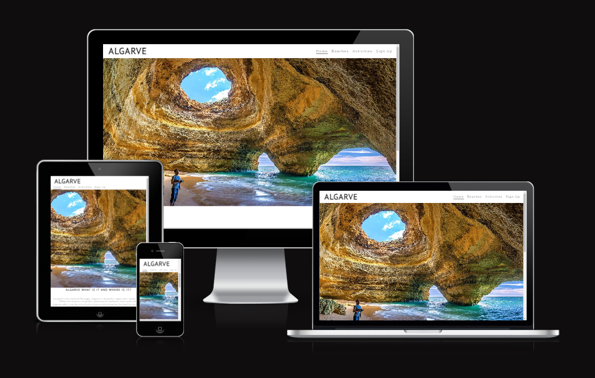

# ALGARVE

## This website is about Algarve, 

The website is targeted for everyone, from young to elderly, from couples to families, there’s something for everybody’s taste :).

You can explore the different beaches and types of activities you may desire to explore and feel the thrill.

Algarve is calling for you, expect adventures and wonderful memories with your love ones.

Users of this website will acquire knowledge about beaches and activities, from temperatures to locations.

Also, in the Sign up page you can request more info about the same beaches/activities or others that you might have hear of in Algarve.
 

[My website on Am I Responsive](https://ui.dev/amiresponsive?url=https://b1ndark.github.io/project1/)

## Features
 

- ### [Navigation](assets/images/readme-images/navigation.png)

    - Featured at the top of the page, the navigation shows the Algarve name on the left corner, Algarve logo that links to the top of the home page.
    - To the right are other navigation links: Beaches, Activities and Sign Up which link to diferente pages.

 

- ### [The Header](assets/images/readme-images/header.png)

    - The header presents a photo of Benagil cave located in Algarve
    - The header explains to the user what Algarve is and where is it.

 

- ### [Beaches](assets/images/readme-images/beaches.png)

    - The Beaches page presents examples of beaches in the coast of Algarve.
    - Also presents info about them like their water temps and locations.

 

- ### [Activities](assets/images/readme-images/activities.png)

    - The Activites page presents examples of activities that can be done in Algarve.
    - ALso presents info about them and their locations.

 

- ### [Sign Up](assets/images/readme-images/signup.png)

    - The Sign Up page allows the user to contact to obtain more info regarding the content presented.
    - Also other info on other beaches or type of activites that we might be able to help with.

 

- ### [Confirmation](assets/images/readme-images/confirmation.jpg)

    - This page is to let the user know that the application has been received

 

___ 

## Testing

- I have tested the website and it works on diferent types of browsers like Chrome, Safari and Firefox.
- I have also tested and work on different mobile phone brands such Iphones, Realmes, Huaweis, Samsungs and also Xiaomis.
- The project is responsive as I have tested it on diferent types of screen sizes using devtools.
- All content of every page is readable and easy to understand.
- All locations presented on the website work, once you click them it will open a new tab.
- The form in the Sign Up page works as it should, email field only accepts emails and submit button works.
 
___ 

## Bugs

- Fixed issue with header where the form was overlapping the header.
    - Initialy fixed it by using z-index, but as it was bad practice I found a way around it and removed the z-index.
- Discovered that there was a bug with smaller screens where the Home button on the nav bar would go under the under the Sign Up button.
    - Reduced the letter-spacing to 1px.
- Issue with scroll bar on horizontal
    - fixed it is by reducing px on the images width from 375px to 360px
- The footer on the home page was showing in front of Algarve info
    - fixed it by putting the Algarve info inside of DIVs
 
___ 

## Problems

- I did have a problem with website running on Chrome, it was accused of being unsafe([Screenshot](assets/images/readme-images/bug/deceptivesite.png)), I tried it on different browsers such as Firefox, Safari, Microsoft Edge and they all worked fine with no issues.
- I couldn't find any issues with any part of the code so I contacted google regarding the issue and requested them to verify the website by following this [steps](https://support.google.com/webmasters/answer/9008080?hl=en#cms&zippy=%2Csites-that-use-a-website-hosting-platform-wordpress-shopify-wix-etc). After being verified, it was considered safe again([Screenshot](assets/images/readme-images/bug/googlesafe.webp)). 
 

___

## Wireframes

- Created for mobile devices and desktops
    - [Home page](assets/images/readme-images/wireframe/homewireframepcandmobile.webp)
    - [Beaches page](assets/images/readme-images/wireframe/beacheswireframepcandmobile.webp)
    - [Activities page](assets/images/readme-images/wireframe/activitieswireframepcandmobile.webp)
    - [Sign Up](assets/images/readme-images/wireframe/signupwireframepcandmobile.webp)
    - [Confirmation page](assets/images/readme-images/wireframe/confirmationwireframesmobile.webp)

___

## Validator Testing

- HTML
    - No errors were found when tested with W3C vallidator
        - [Home page](assets/images/readme-images/w3c-validator/homevalidator.png)
        - [Beaches page](assets/images/readme-images/w3c-validator/beachesvalidator.png)
        - [Activities page](assets/images/readme-images/w3c-validator/activitiesvalidator.png)
        - [Sign Up page](assets/images/readme-images/w3c-validator/signupvalidator.png)
        - [Confirmation page](assets/images/readme-images/w3c-validator/confirmationvalidator.png)
        - [404 Error page](assets/images/readme-images/w3c-validator/404errorpagevalidator.png)
- CSS
    - No errors were found when tested with Jigsaw validator
        - [CSS](assets/images/readme-images/w3c-validator/cssvalidator.png)
- Accessibility
    - I can confirm that the fonts and colors chosen are easy to read and also Lighthouse performed really good
 

## Lighthouse screenshots

- [Home page](assets/images/readme-images/lighthouse-performance/homeperformance.png)

- [Beaches page](assets/images/readme-images/lighthouse-performance/beachesperformance.png)

- [Activities page](assets/images/readme-images/lighthouse-performance/activitiesperformance.png)

- [Sign Up page](assets/images/readme-images/lighthouse-performance/signupperformance.png)

- [Confirmation page](assets/images/readme-images/lighthouse-performance/confirmationperformance.png)

 
___ 

## Deployment

- The website was deployed to Github pages. Steps to deploy:
    - In the Github repository, navigate to the settings tab
    - then scroll down and on your left select Pages and go to branch
    - once the master branch has been selected, wait a a momment and it will provide a page link to the completed website.
The live link can be found here - [My Website](https://b1ndark.github.io/project1/)
 
___ 

## Credits

 - ### Content

    - [Visit Portugal](https://www.visitportugal.com/en/node/141915)
    - [Sun-hat-villas](https://www.sun-hat-villas.com/algarve/carvoeiro/beaches/praia-do-carvalho)
    - [Algarve Tourist](https://www.algarve-tourist.com/praia-da-rocha-portugal-algarve-guide.html)
    - [Algarve Cave Tours](https://www.algarvecavetours.com/)
    - [Skydiving Algarve](https://www.skydivealgarve.com/)
    - [Zoomarine](https://www.zoomarine.pt/en/)
 

 - ### Media

    - Various resources used to get the photos and some of them by myself.

    - Websites used-
       - [PicJumbo](https://picjumbo.com)
       - [Pixabay](https://pixabay.com)
       - [Unsplash](https://unsplash.com)
       - [Pexels](https://www.pexels.com)

    - Photos Authors and where to find them:
       - camilobeach - photo of Camilo beach - by Lukas [Talab](https://picjumbo.com/couple-on-a-beach-enjoying-sunrise/)
       - rochabreach - photo of Rocha beach in Portimao - by me
       - carvalhobeach - photo of Carvalho beach near Benagil - by me
       - benagilcave - photo of a beach inside a cave in Benagil - by [Julius_Silver](https://pixabay.com/photos/portugal-algarve-benagil-selfie-3029665/)
       - cavetour - photo of cave tours in Algarve - by [Max Zed](https://unsplash.com/photos/RhCcwI570bE)
       - algarvesunset - photo of sunset in Algarve - by [ddzphoto](https://pixabay.com/photos/portugal-beach-sunset-sea-scenic-2392312/)
       - zoomarine - photo of Zoomarine which is located at Albufeira in Algarve - by [Craig Lovelidge](https://unsplash.com/photos/5iiI5wVXY8M)
       - skydiving - photo of a people skydiving and you can see the Algarve International Circuit in the background where Formula 1 and moto GP occurs - by [Kamil Pietrzak](https://unsplash.com/photos/G0FsO2Ca8nQ)
       - benagilcaveconfirmation - photo of benagil - by [Jo Kassis](https://www.pexels.com/photo/people-near-a-body-of-water-under-a-cave-hole-5339442/)
       - 404error - photo of a sad face - by [OpenClipart-Vectors](https://pixabay.com/vectors/comic-characters-depressed-emotion-2026645/)
    
    - To convert the photos I have used:
        - [Cloud Convert](https://cloudconvert.com/)

    - The Icon on the website tab I have used [Favicon](https://favicon.io/emoji-favicons/sun/)

    - For the GPS locations I have used [Google maps](https://www.google.com/maps/).
    
    - The screenshots supplied to decorate the Readme file I have used [Gyazo](https://gyazo.com/)
    
    - Footer social network links from:
        - [Facebook](https://www.facebook.com/)
        - [Instagram](https://www.instagram.com/)
        - [Twitter](https://twitter.com/)
        - [Youtube](https://www.youtube.com/)